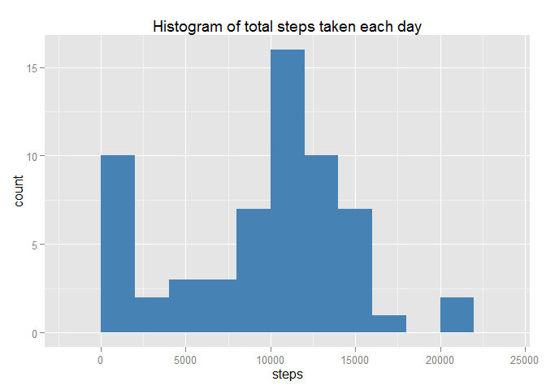
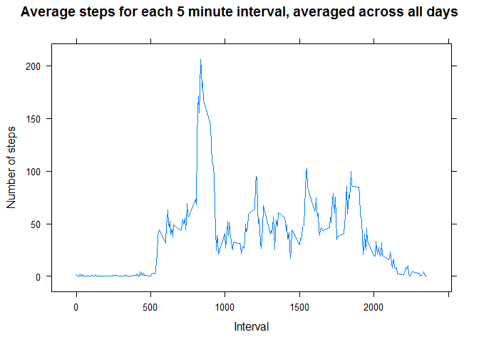
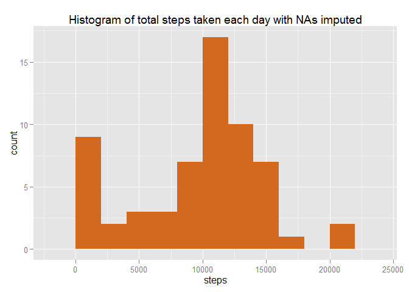
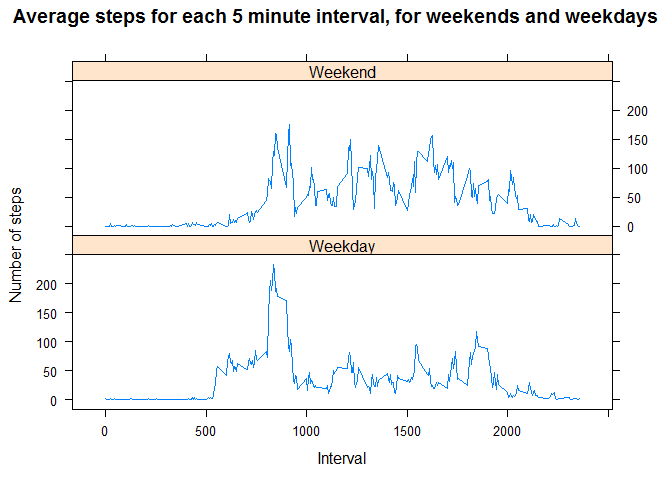

# Reproducible Research: Peer Assessment 1


## Loading and preprocessing the data
The GitHub repository contains the dataset, so it can just be unzipped. No pre-processing of the data is required at this stage.


```r
unzip("activity.zip")
activity <- read.csv("activity.csv")
```

## What is mean total number of steps taken per day?
A total sum of steps for each day can be calculated using `summarize()`. This can be plotted as a histogram to show the distribution of total daily steps.


```r
library(ggplot2)
suppressMessages(library(dplyr))

daily.activity <- activity %>%
    group_by(date) %>%
    summarize(steps = sum(steps, na.rm = TRUE))

g1 <- ggplot(daily.activity, aes(x = steps)) +
    geom_histogram(binwidth = 2000, fill = "steelblue") +
    labs(title = "Histogram of total steps taken each day")
g1
```

 

The mean and the median of the total number of steps per day is easily calculated. In this case we will store the answers in a vector so they can be reused in a later comparison.

```r
original.ave <- c(mean = round(mean(daily.activity$steps)),
                  median = round(median(daily.activity$steps)))
original.ave
```

```
##   mean median 
##   9354  10395
```

## What is the average daily activity pattern?
The following plot shows the average number of steps for each 5 minute interval within a day.


```r
ia <- activity %>%
    group_by(interval) %>%
    summarize(steps = mean(steps, na.rm = TRUE))

library(lattice)
xyplot(steps ~ interval, ia, 
       type = "l", 
       main = "Average steps for each 5 minute interval, averaged across all days",
       xlab = "Interval",
       ylab = "Number of steps")
```

 

The interval containing the maximum number of steps can be calculated, and averaged across all days. Using the mode would be the most appropriate method here. We'll calculate the mean and median as well, for comparison.


```r
max.activity <- activity %>%
    group_by(date) %>%
    # which.max() causes an error if all values for a day are NA, because it 
    # returns an integer instead of a vector of size 1. 
    # Adding "0" to the end of the steps vector prevents this, and returns NA
    # when we attempt to lookup that index in the interval vector.
    summarize(interval = interval[which.max(c(steps, 0))]) 

suppressMessages(library(modeest))
c(mode = mlv(max.activity$interval, na.rm = TRUE)$M,
  median = median(max.activity$interval, na.rm = TRUE),
  mean = round(mean(max.activity$interval, na.rm = TRUE)))
```

```
##   mode median   mean 
##    815    925   1182
```

The 5-minute interval which contains the most steps on average is 815.

## Imputing missing values
Calculate the number of missing values in the dataset.


```r
sum(is.na(activity$steps))
```

```
## [1] 2304
```

To impute the missing values we will replace them with the mean value for that 5 minute interval. This can be looked up from `ia` generated in the second part of this analysis. The mean and median values can be compared with the values calculated in the first part of this analysis

```r
act2 <- activity
act2$na <- is.na(act2$steps)
act2$steps <- replace(act2$steps,
                      act2$na,
                      # Reuse ia from the second part of this analysis.
                      round(ia$steps[ia$interval == act2$interval[act2$na]]))

daily.act2 <- act2 %>%
    group_by(date) %>%
    summarize(steps = sum(steps, na.rm = TRUE))

imputed.ave <- c(mean = round(mean(daily.act2$steps)),
                 median = round(median(daily.act2$steps)))
data.frame(original.ave, imputed.ave)
```

```
##        original.ave imputed.ave
## mean           9354        9531
## median        10395       10439
```

This shows that the mean and median values have increased. This is because the NA values originally contributed zero to the daily total. In the imputed data, the mean value for that interval is used instead, increasing the totals. 

The histogram below shows that the distribution of total steps hasn't changed a lot after imputing the NA values. A single day has moved from the bin including zero to the bin including the mean. Presumably this day had most or all values as zero, so the majority of values in this day were modified.


```r
g2 <- ggplot(daily.act2, aes(x = steps)) +
    geom_histogram(binwidth = 2000, fill = "chocolate") +
    labs(title = "Histogram of total steps taken each day with NAs imputed")
g2
```

 

## Are there differences in activity patterns between weekdays and weekends?
The plot below of activity for weekdays and weekends shows that activity starts later on a weekend but is generally higher for the rest of the day outside rush hour.


```r
library(lubridate)
activity <- activity %>%
    mutate(date = ymd(date)) %>%
    mutate(day.type = factor(ifelse(weekdays(date) %in% c("Saturday", "Sunday"),
           "Weekend",
           "Weekday")))

weekend.activity <- activity %>%
    group_by(interval, day.type) %>%
    summarize(steps = mean(steps, na.rm = TRUE))

xyplot(steps ~ interval | day.type, weekend.activity, 
       type = "l", 
       layout = c(1, 2),
       main = "Average steps for each 5 minute interval, for weekends and weekdays",
       xlab = "Interval",
       ylab = "Number of steps")
```

 
